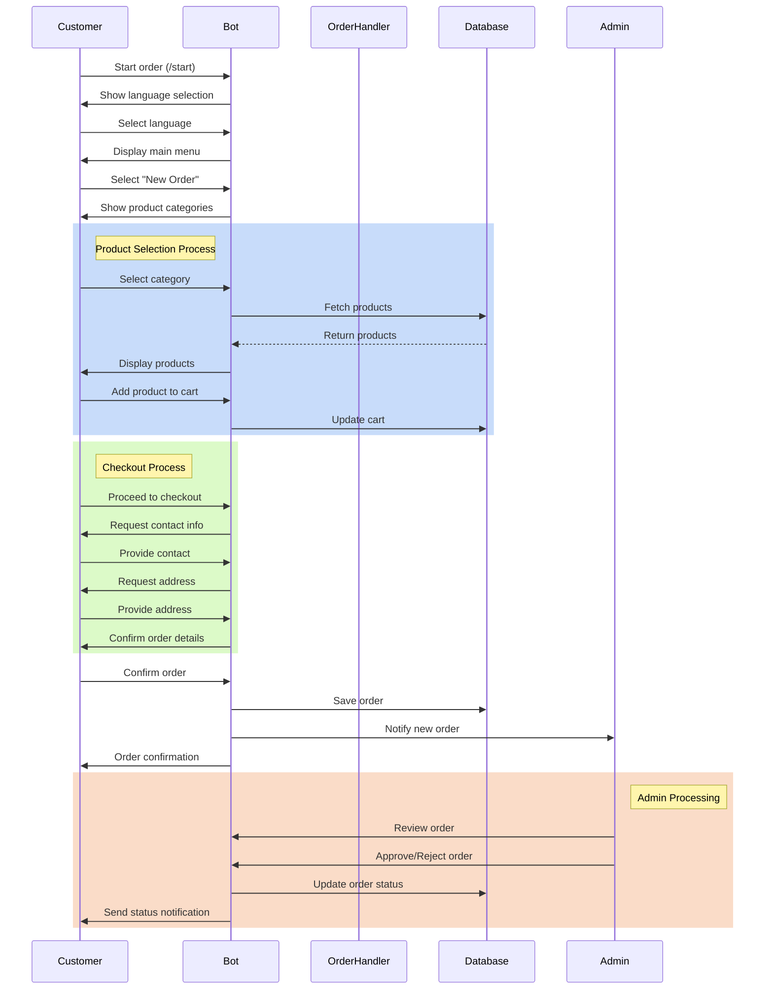
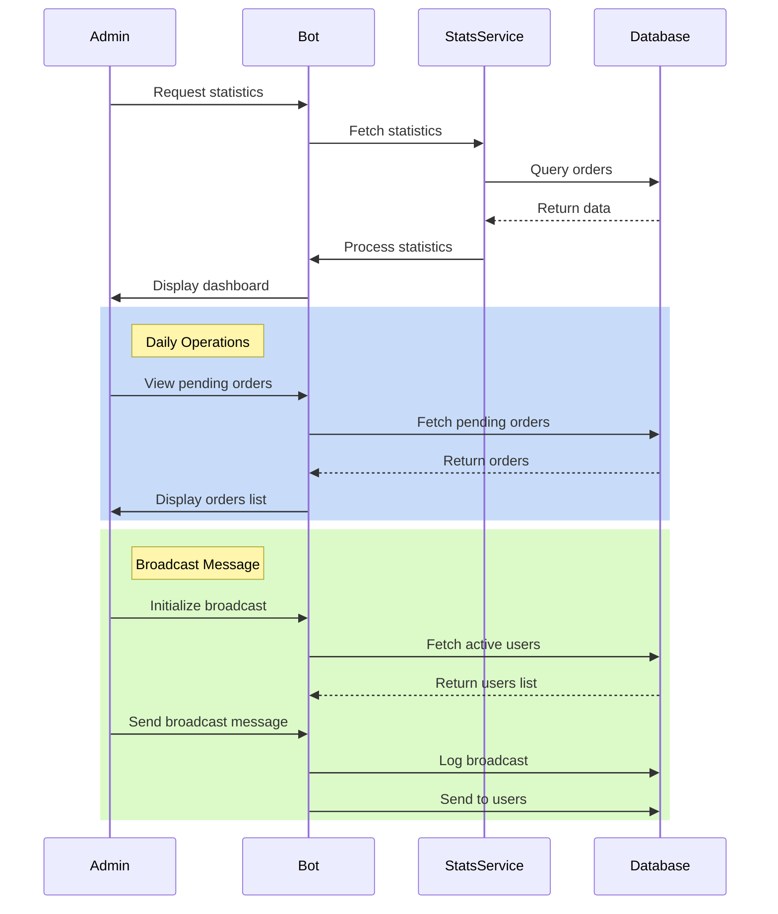

# LemneNord Bot

A Telegram bot built with Ruby for managing orders and interactions with LemneNord services.

## Description

LemneNord Bot is a Telegram bot that helps manage orders, user interactions, and administrative tasks. The bot is built using Ruby and includes features for both users and administrators.

## Features

- User management system
- Shopping cart functionality
- Admin panel with specialized controls
- Order processing and tracking
- Message handling system
- Callback query processing

## Tech Stack

- Ruby
- Telegram Bot API
- SQLite/PostgreSQL (database)
- Rake (task automation)

## Project Structure

## Features

### User Features
- 🌐 Language selection (Russian/Romanian)
- 🛒 Multi-step order creation with product selection
- 📋 Order history tracking
- 📍 Saved addresses and phone numbers
- 💰 Price calculation and order confirmation
- 🔔 Order status notifications

### Admin Features
- 📊 Real-time statistics dashboard
- ⏳ Order management (approve/reject/ignore)
- 📢 Broadcast messages to users
- 📅 Scheduled daily statistics
- 🚨 Health monitoring and alerts
- 🔄 Automated database backups

## Admin Commands

- 📊 Статистика - System statistics
- ⏳ Ожидающие - Pending orders
- ✅ Принятые - Approved orders
- ❌ Отклоненные - Rejected orders
- 📢 Рассылка - Broadcast message
- 📢 Сообщение в канал - Post to channel

## Sequence Diagrams

### Order Flow

### Admin Dashboard Flow

These sequence diagrams illustrate:
1. **Order Flow**: Complete customer journey from order initiation to completion
2. **Admin Dashboard**: Administrative operations including statistics and broadcast messaging

## Tech Stack
- **Language**: Ruby
- **Framework**: ActiveRecord (ORM)
- **Database**: SQLite (development), PostgreSQL (production)
- **Telegram Integration**: `telegram-bot-ruby` gem
- **Scheduling**: Rufus-scheduler
- **Caching**: Rails.cache (in-memory)
- **Logging**: Custom logger with rotation

